<div align="center">

<picture>
  <source media="(prefers-color-scheme: dark)" srcset="assets/banner-dark.svg">
  
</picture>

</div>

```console
arwin@osaka:~$ whoami
Computer Engineer & Web Developer — cinematic, high-performance interfaces

arwin@osaka:~$ uptime
shipping since 2024 · currently Associate Developer @ Avorino

arwin@osaka:~$ currently_shipping
avorino.com growth stack · hanami portfolio (procedural Three.js floating-island hero)

arwin@osaka:~$ cat stack.txt
Next.js · React 19 · TypeScript · Tailwind v4 · GSAP · Three.js · Bun · Hono · PostgreSQL · Cloudflare

arwin@osaka:~$ cat ai.txt
Claude Code · Gemini API · OpenAI Codex — LLM-integrated features & agentic workflows
```

<div align="center">

[](https://arwinmiclat-portfolio.vercel.app/)
[](https://www.linkedin.com/in/arwin-miclat/)
[](mailto:arwinmiclat@gmail.com)
[](https://arwinmiclat-portfolio.vercel.app/cv/Arwin_Gerard_Miclat_Resume.pdf)

</div>

## 数字 · By the numbers

| | |
|---|---|
| **37 cities · ~150 pages · ~1,800 CMS entries** | Programmatic local-SEO system I built solo @ Avorino, with automated Search Console indexing |
| **5 products shipped 2025–26** | Marketing sites, SaaS platforms, and tools across construction, fintech, and consumer |
| **Procedural 3D hero, phone-friendly** | Hand-sculpted Three.js floating-island diorama, quality-tiered from desktop to mobile |
| **RBAC platform on a 4-engineer team** | Roles/permissions UI + middleware guarding every route of a wholesale operations portal |

## 作品 · Selected work

| | Project | What it is |
|---|---|---|
| 壱 ★ | **[Avorino](https://avorino.com)** | Luxury ADU/construction brand site + growth engineering — Gemini cost estimator, lead funnel, first-party analytics. My daily craft. |
| 弐 | **[Nexwin Capital](https://nexwincapital.com)** | Lead-gen marketing site + admin CRM for a California loan broker — Next.js front, Bun/Hono API, gold-wireframe Three.js hero. |
| 参 | **[ADUPortal](https://aduportal.com)** | ADU planning platform — cost estimator, loan qualifier, and ROI calculators sharing one project file. |
| 肆 | **[SimpleProjex](https://simpleprojex.com)** | Construction proposal SaaS — marketing site with live-pricing proposals pitch (Next.js + Django Ninja platform behind it). |
| 伍 | **[KKB](https://kkb-three.vercel.app)** | Neobrutalist bill-splitting app — client-only, localStorage, QR share. Kanya-kanyang bayad. |

## 道具 · Stack

**Frontend** —      

**Backend** —     

**Platform** —  

**AI & LLMs** —    

<div align="center">

— 桜 —

*Osaka-inspired · Pampanga-built*

</div>
